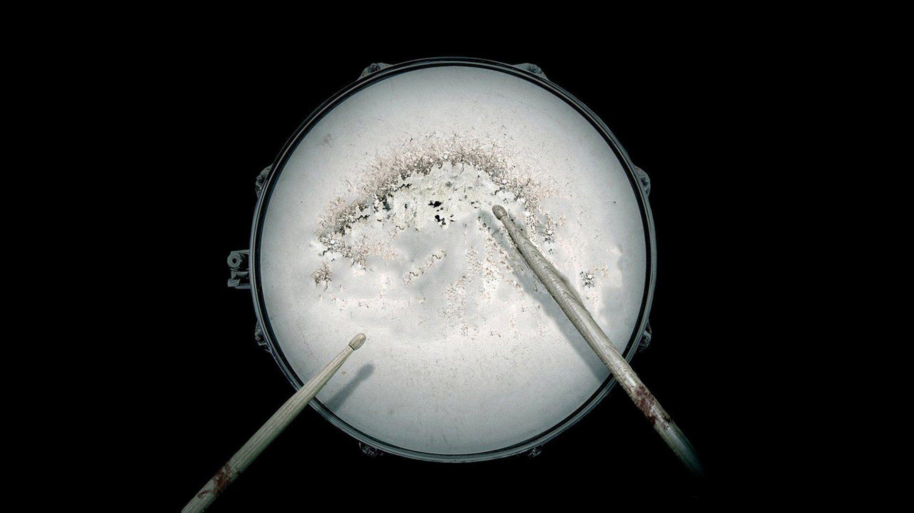

# Drum Kit Website

A simple website that allows you to play drums using your keyboard. Each key corresponds to a different drum sound.

## Table of Contents

- [Introduction](#introduction)
- [Usage](#usage)
- [Keyboard Shortcuts](#keyboard-shortcuts)
- [License](#license)

## Introduction

The Drum Kit Website is a fun and interactive project from Wes bos's JavaScript30 that lets you simulate playing drums by using your computer's keyboard(or touch screen). Each key on your keyboard corresponds to a different drum sound, allowing you to create your own beats and rhythms.

## Usage

1. Open the [Drum Kit Website](https:/ahmedalharees.github.io/drum-kit) in your web browser.
2. Use your computer keyboard to play the drums:
   - Press the corresponding keys (A, S, D, F, G, H, J, K, L) to play different drum sounds.
   - Each drum sound is associated with a specific key, and pressing the key will trigger the corresponding sound.
3. Get creative and experiment with different combinations to create your own music!

## Keyboard Shortcuts

| Key | Drum Sound |
|----|------------|
| A  | Clap       |
| S  | Hihat      |
| D  | Kick       |
| F  | Openhat    |
| G  | Boom       |
| H  | Ride       |
| J  | Snare      |
| K  | Tom        |
| L  | Tink       |

## License

This project is licensed under the [MIT License](LICENSE).
